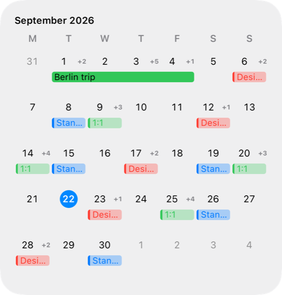
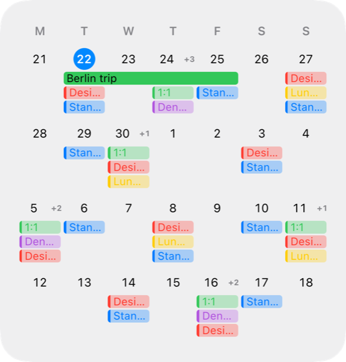
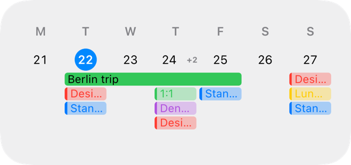
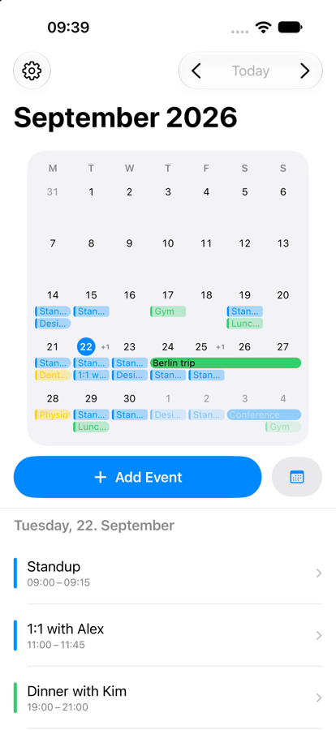
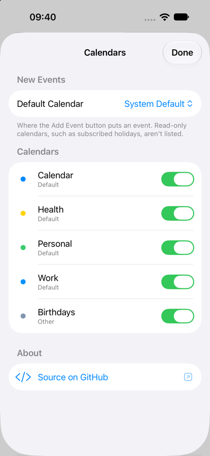

# BetterCalendarWidgets for iOS!

This app provides some more widgets for those who want to use iOS native calendar. Keep it short and simple!

## Screenshots

The events shown here are made up — they don't come from anyone's real calendar.

### Widgets

Five widgets, all drawing the same grid: Month, and then 4, 3, 2 and 1 weeks starting from the current week. Fewer weeks means taller rows, so each one fits more of a busy day's events before collapsing the rest into a `+n`. All-day events take their calendar's colour solid and stretch across the days they cover; events with a time are washed out with a stripe of the colour down the side.

| Month | 4 Weeks | 1 Week (medium) |
| --- | --- | --- |
|  |  |  |

### App

The app shows the month at the size it occupies as a widget, the selected day's events below it, and a button that hands the day over to Apple's Calendar. Tapping an event opens EventKit's editor; Add Event creates one on the selected day at the current time. Settings picks which calendar new events go to, and which calendars appear at all.

| App | Settings |
| --- | --- |
|  |  |

### Caution
Beware: This is a vibe coded app. I'm no developer and certainly no Swift/iOS developer - I just needed this app for myself. Since I wasn't able to find a free and open source one, I figured this might be a good time to try out claude. I hope there's no dangerous code in here, but I can't guarantee anything! Use at your own risk. Forking and/or adding your own features welcome.
